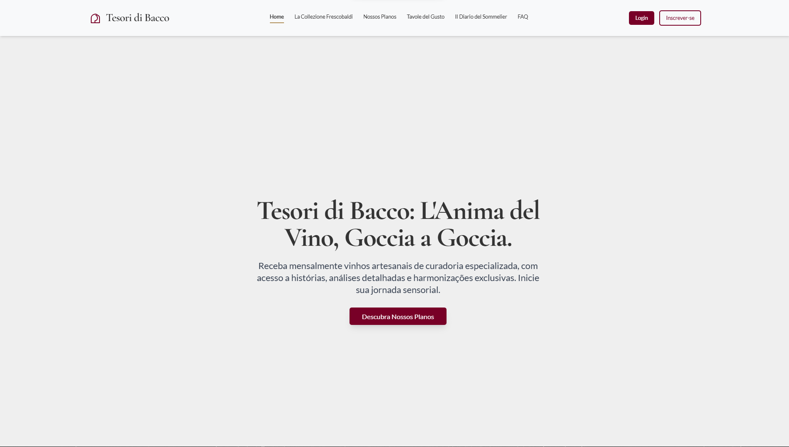
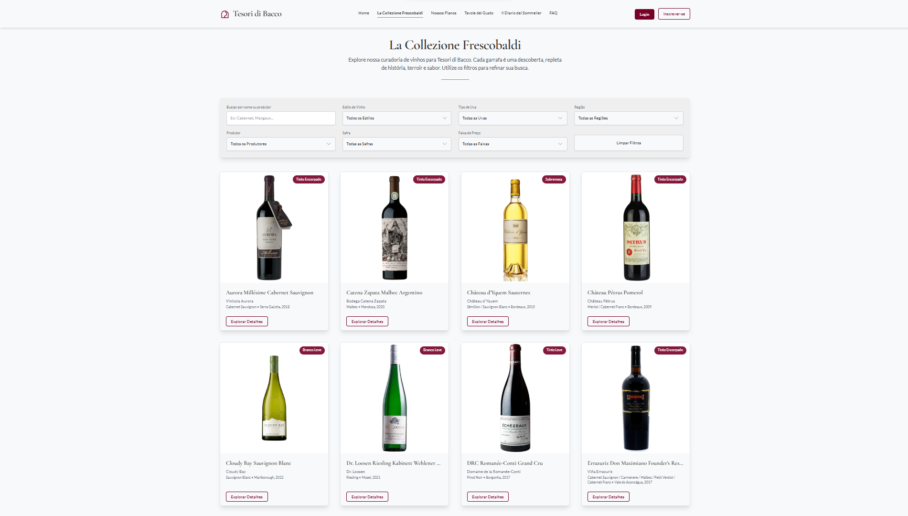
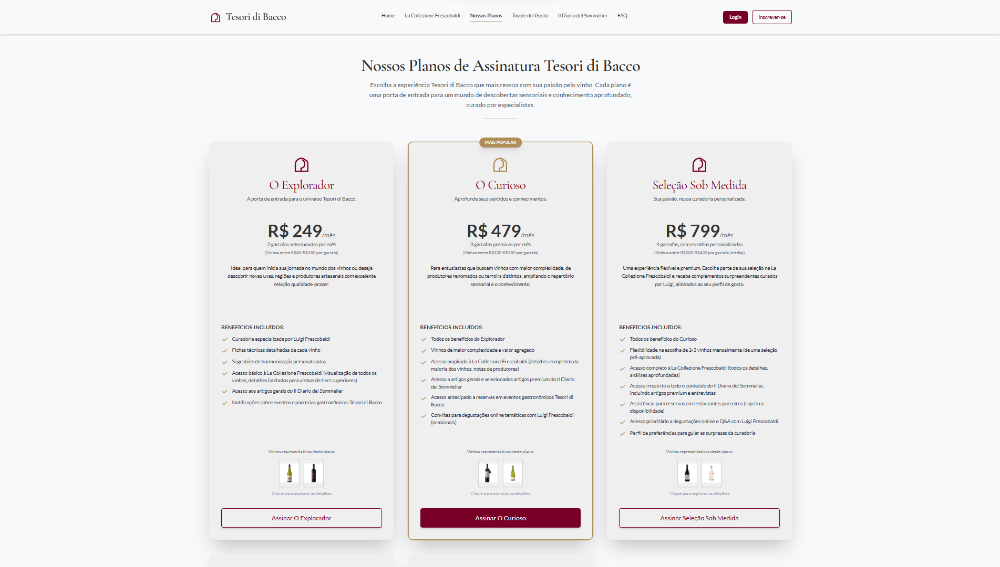
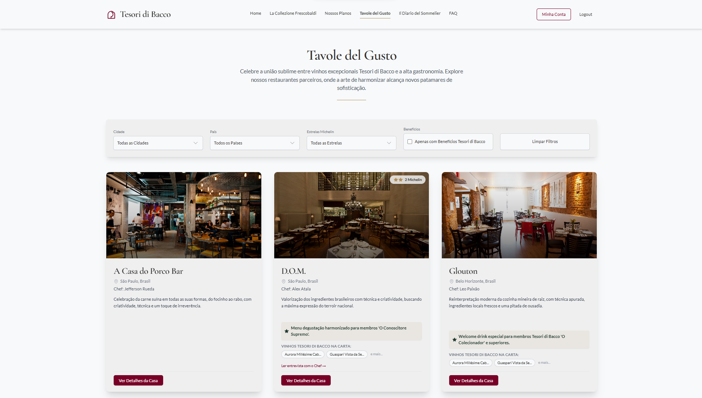
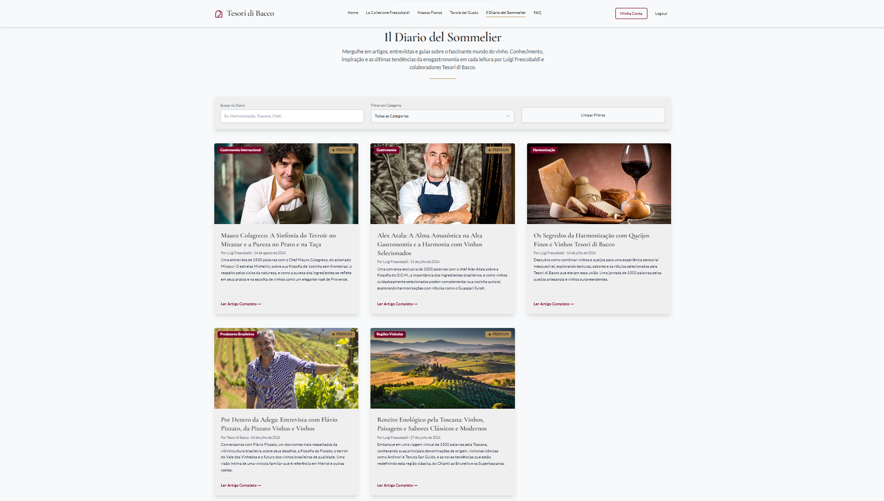

# Tesori di Bacco - Clube de Vinhos Premium

> **Nota Importante**: Este é um projeto pessoal desenvolvido exclusivamente para fins de estudo e demonstração de habilidades em desenvolvimento front-end. Nasceu da combinação entre minha paixão por vinhos, pela rica cultura italiana e pela programação. Embora o website e toda a experiência possam parecer reais e profissionais, trata-se apenas de um projeto fictício criado para explorar tecnologias modernas e conceitos de UX/UI. Todos os dados são simulados e não representam uma empresa ou serviço real.

## 🌐 Demo Online

**Acesse a aplicação em tempo real**: [https://tesoridibacco.netlify.app/](https://tesoridibacco.netlify.app/)

A aplicação está hospedada no Netlify com deploy automático e pode ser testada completamente online. Explore todas as funcionalidades, navegue pelo catálogo de vinhos, teste o sistema de assinatura e descubra a experiência completa do Tesori di Bacco diretamente no seu navegador.

## 🔐 Credenciais para Teste

Para testar o sistema de autenticação e diferentes níveis de acesso, utilize as seguintes credenciais de usuários pré-cadastrados:

### Usuários de Teste Disponíveis

| **Email** | **Senha** | **Tier** | **Descrição** |
|-----------|-----------|----------|---------------|
| `explorador@gmail.com` | `senha123` | Il Principiante | Tier básico para iniciantes |
| `curioso@gmail.com` | `senha123` | L'Esploratore | Tier mais popular |
| `sobmedida@gmail.com` | `senha123` | L'Intenditore | Tier intermediário |
| `colecionador@gmail.com` | `senha123` | Il Raffinato | Tier avançado |
| `conoscitore@gmail.com` | `senha123` | O Conoscitore Supremo | Tier premium |
| `elitedibacco@gmail.com` | `senha123` | L'Elite di Bacco | Tier VIP exclusivo |

> **Dica**: Cada usuário possui diferentes níveis de acesso e benefícios. Teste com diferentes contas para experimentar todas as funcionalidades disponíveis em cada tier de assinatura.

## 📕 Descrição

Tesori di Bacco é uma aplicação web front-end sofisticada concebida como uma plataforma exclusiva para um clube de vinhos premium inspirado na tradição italiana. Este projeto foi meticulosamente desenvolvido utilizando tecnologias modernas para proporcionar aos usuários uma experiência digital rica e elegante, centrada na descoberta e apreciação de vinhos selecionados. A arquitetura da aplicação segue padrões modernos de componentização React, oferecendo uma navegação fluida entre um catálogo abrangente de vinhos artesanais, diferentes níveis de assinatura exclusivos, parcerias com restaurantes renomados e conteúdo editorial especializado sobre o universo vinícola. O sistema se destaca pela sua identidade visual refinada, interface responsiva construída com Tailwind CSS, sistema de autenticação simulado robusto e uma experiência de usuário cuidadosamente elaborada que reflete a elegância e tradição da cultura vinícola italiana.

## 📸 Screenshots

### Homepage


### Catálogo de Vinhos - La Collezione Frescobaldi


### Sistema de Assinatura


### Tavole del Gusto - Restaurantes Parceiros


### Il Diario del Sommelier - Blog Editorial


## 🍷 Funcionalidades

- ✅ **Sistema de Verificação de Idade**: Portal de entrada com validação CPF e aceite de termos
- ✅ **Catálogo de Vinhos Completo**: Exploração detalhada da "La Collezione Frescobaldi"
  - **Filtros Avançados**: Por região, uva, produtor, safra, estilo e faixa de preço
  - **Busca Inteligente**: Por nome do vinho ou produtor
  - **Interface Responsiva**: Filtros adaptáveis para mobile
- ✅ **Páginas de Detalhes Imersivas**: Informações completas de vinhos e produtores
  - **Notas de Degustação**: Perfil aromático e análise sensorial
  - **Harmonização Detalhada**: Sugestões gastronômicas com receitas
  - **Parcerias Gastronômicas**: Restaurantes que servem cada vinho
- ✅ **Sistema de Assinatura**: Seis níveis de planos exclusivos
  - **Planos Públicos**: Do iniciante ao conhecedor supremo
  - **Planos VIP**: Acesso por convite para membros elite
  - **Área do Membro**: Dashboard personalizado com histórico
- ✅ **Tavole del Gusto**: Rede de restaurantes parceiros
  - **Filtros por Localização**: Cidade, país e estrelas Michelin
  - **Benefícios Exclusivos**: Vantagens para membros do clube
  - **Perfis Completos**: Chef, filosofia, pratos assinatura
- ✅ **Il Diario del Sommelier**: Blog editorial especializado
  - **Artigos Premium**: Conteúdo exclusivo para assinantes
  - **Busca por Categoria**: Vinificação, degustação, terroir
  - **Autores Especialistas**: Sommeliers e enólogos renomados
- ✅ **Autenticação Completa**: Login, cadastro e gerenciamento de perfil

## 🛠️ Tecnologias

- **React 19.1.0**: Biblioteca principal para componentes interativos
- **TypeScript 5.7.2**: Tipagem estática para robustez do código
- **Vite 6.2.0**: Sistema de build moderno e servidor de desenvolvimento rápido
- **Tailwind CSS 4.1.8**: Framework utilitário para estilização elegante
- **React Router DOM 7.6.1**: Roteamento SPA com navegação fluida

### Design & UX

- **Cormorant Garamond**: Tipografia serifada para títulos elegantes
- **Lato**: Fonte limpa para corpo de texto e interface
- **Paleta Refinada**: Burgundy (#780027), Gold (#B08D57), Charcoal (#333333)
- **Animações Suaves**: Transições de página e efeitos de entrada
- **Interface Responsiva**: Adaptação completa para dispositivos móveis

## 📋 Pré-requisitos

- Node.js 18+ ou superior
- npm ou yarn (gerenciador de pacotes)
- Navegador moderno com suporte a ES6+

## 🚀 Instalação

```bash
# Clonar o repositório
git clone https://github.com/seu-usuario/tesori-di-bacco.git
cd tesori-di-bacco

# Instalar dependências
npm install
# ou
yarn install

# Iniciar servidor de desenvolvimento
npm run dev
# ou
yarn dev
```

## ⚙️ Configuração

O projeto utiliza dados mockados definidos em `src/constants.ts`. Para personalização:

1. **Identidade da Marca**:
   ```typescript
   export const APP_NAME = "Tesori di Bacco";
   export const APP_FULL_NAME = "Tesori di Bacco";
   export const APP_MOTTO = "L'Anima del Vino, Goccia a Goccia.";
   ```

2. **Configuração de Cores** (em `index.html`):
   ```css
   :root {
     --burgundy-accent: #780027;
     --gold-accent: #B08D57;
     --charcoal-gray: #333333;
   }
   ```

3. **Dados Mockados**: Customize vinhos, restaurantes e artigos em `constants.ts`

## 🖥️ Executando a Aplicação

```bash
# Desenvolvimento
npm run dev

# Build de produção
npm run build

# Preview do build
npm run preview

# Linting
npm run lint
```

Acesse `http://localhost:5173` para visualizar a aplicação.

## 🍾 Como Usar

### Verificação de Idade
1. Ao acessar pela primeira vez, complete a verificação de idade
2. Forneça CPF e aceite os termos de uso
3. Escolha entre Login, Cadastro ou navegação como convidado

### Exploração do Catálogo
1. **La Collezione Frescobaldi**: Navegue pelo catálogo completo
2. **Filtros Inteligentes**: Use filtros por região, uva, produtor
3. **Detalhes do Vinho**: Clique em qualquer vinho para informações completas

### Sistema de Membership
```
Planos Disponíveis:
├─ Tier 1: Il Principiante (R$ 179/mês)
├─ Tier 2: L'Esploratore (R$ 349/mês) - MAIS POPULAR
├─ Tier 3: L'Intenditore (R$ 549/mês)
├─ Tier 4: Il Raffinato (R$ 799/mês)
├─ Tier 5: O Conoscitore Supremo (R$ 1.299/mês)
└─ Tier 6: L'Elite di Bacco (Por convite)
```

### Tavole del Gusto
- Explore restaurantes parceiros com estrelas Michelin
- Filtre por localização e benefícios para membros
- Descubra harmonizações exclusivas

## 🧪 Estrutura do Projeto

```
src/
├── components/          # Componentes reutilizáveis
│   ├── icons/          # Ícones SVG customizados
│   ├── Button.tsx      # Botão com variantes
│   ├── Modal.tsx       # Modal genérico
│   ├── Header.tsx      # Navegação principal
│   └── Footer.tsx      # Rodapé informativo
├── pages/              # Páginas da aplicação
│   ├── HomePage.tsx    # Landing page principal
│   ├── AdegaEclatPage.tsx     # Catálogo de vinhos
│   ├── WineDetailPage.tsx     # Detalhes do vinho
│   ├── MembershipPlansPage.tsx # Planos de assinatura
│   └── MembersAreaPage.tsx    # Dashboard do membro
├── types.ts            # Definições TypeScript
├── constants.ts        # Dados mockados e constantes
└── App.tsx            # Componente raiz e roteamento
```

## 🎨 Design System

### Paleta de Cores
- **Burgundy Accent** (`#780027`): Ações primárias e destaques
- **Gold Accent** (`#B08D57`): Elementos de luxo e popularidade
- **Charcoal Gray** (`#333333`): Textos principais
- **Ice White** (`#F8F9FA`): Backgrounds limpos

### Componentes Principais
- **WineCard**: Card elegante para vinhos com hover effects
- **SectionTitle**: Títulos padronizados com divisores dourados
- **Modal**: Sistema de modais para confirmações
- **Button**: Botões com 4 variantes (primary, secondary, outline, text)

## 📱 Features Responsivas

### Desktop
- Navegação horizontal completa
- Filtros laterais na página de vinhos
- Layout em múltiplas colunas

### Mobile
- Menu hambúrguer responsivo
- Filtros em modal overlay
- Cards adaptáveis ao toque
- Tipografia otimizada para leitura

## 🔐 Sistema de Autenticação

### Context Provider
```typescript
const AuthContext = createContext<AuthContextType | undefined>(undefined);
```

### Funcionalidades
- **Login**: Validação contra usuários mockados
- **Cadastro**: Criação de novos usuários (tier1 padrão)
- **Persistência**: LocalStorage para sessões
- **Área do Membro**: Dashboard personalizado
- **Logout**: Limpeza completa de sessão

## 🍽️ Integrações Gastronômicas

### Restaurantes Parceiros
- **Filtros Avançados**: Por estrelas Michelin e benefícios
- **Perfis Completos**: Chef, filosofia, ambiente
- **Vinhos Servidos**: Integração com catálogo Éclat
- **Benefícios Exclusivos**: Vantagens para cada tier

### Sistema de Harmonização
- Sugestões detalhadas por vinho
- Receitas complementares
- Links para artigos relacionados

## 📚 Blog Editorial

### Il Diario del Sommelier
- **Artigos Premium**: Conteúdo exclusivo marcado
- **Categorias**: Vinificação, Degustação, Terroir, História
- **Busca Inteligente**: Por título, autor, categoria
- **Autores Especialistas**: Perfis de sommeliers fictícios

## 🚀 Build e Deploy

### Build de Produção
```bash
npm run build
# Gera pasta dist/ otimizada
```

### Deploy Sugerido
- **Vercel**: Deploy automático via Git
- **Netlify**: Hosting estático com formulários
- **GitHub Pages**: Para projetos open source

### Otimizações
- Code splitting automático pelo Vite
- Lazy loading de componentes
- Otimização de imagens
- Compressão de assets

## 🛣️ Roadmap

- [ ] **Melhoria no Catálogo de Vinhos**: Adicionar TODAS as imagens necessárias para o website substituindo os placeholders
- [ ] **Melhoria no Catálogo de Vinhos**: Adicionar mais Vinhos
- [ ] **Melhoria no Catálogo de Restaurantes**: Adicionar mais restaurantes e mais conteúdos relacionados
- [ ] **Implementação Total da Responsabilidade Mobile**: Refinar as paginas e os módulos para ficarem mais responsivos a dispositivos moveis
- [ ] **Refinamento do Sistema de Cadastro**: Implementar mais campos de preenchimentos 
- [ ] **Sistema de Pagamento**: Integração com Stripe/PagSeguro
- [ ] **PWA**: Transformar em Progressive Web App
- [ ] **Testes E2E**: Cypress para testes de interface
- [ ] **Internacionalização**: Suporte multi-idioma (PT/EN/IT)
- [ ] **Analytics**: Integração com Google Analytics
- [ ] **SEO Optimization**: Meta tags e sitemap
- [ ] **Sistema de Reviews**: Avaliações de vinhos por membros

## 🎯 Recursos Avançados

### Animações UX
- **Transições de Página**: Fade in/out suave
- **Cards em Cascata**: Efeito staggered nos listings
- **Hover Effects**: Escalas e sombras interativas
- **Scroll Animations**: Elementos aparecem ao rolar

### Performance
- **Lazy Loading**: Carregamento sob demanda
- **Memoização**: React.memo em componentes pesados
- **Virtual Scrolling**: Para listas grandes (futuro)
- **Image Optimization**: WebP e loading lazy

### Acessibilidade
- **Navegação por Teclado**: Suporte completo
- **Screen Reader**: Labels e ARIA adequados
- **Contraste**: Cumprimento das diretrizes WCAG
- **Focus Management**: Estados visuais claros

## 📄 Dados Mockados

### Estrutura Principal
```typescript
// Vinhos (50+ itens)
MOCK_WINES: Wine[]

// Produtores (12 vinícolas)
MOCK_PRODUCERS: WineProducer[]

// Restaurantes (9 estabelecimentos)
MOCK_RESTAURANTS: Restaurant[]

// Artigos do blog (6 artigos)
MOCK_ARTICLES: Article[]

// Planos de assinatura (6 tiers)
MOCK_SUBSCRIPTION_TIERS: SubscriptionTier[]
```

### Relacionamentos
- Vinhos ↔ Produtores (referência direta)
- Vinhos ↔ Restaurantes (array de IDs)
- Usuários ↔ Tiers (por tierId)
- Artigos ↔ Vinhos (featuredWineIds)

## 📜 Licença

Este projeto está licenciado sob a licença MIT - veja o arquivo [LICENSE](LICENSE) para detalhes.

## 🏰 Inspiração Cultural

O projeto se inspira profundamente na rica tradição vinícola italiana, incorporando:
- **Nomenclatura Italiana**: Nomes autênticos e evocativos
- **Estética Clássica**: Design que remete às vinícolas tradicionais
- **Cultura Gastronômica**: Harmonizações respeitando tradições culinárias
- **Exclusividade Artesanal**: Filosofia de produtos únicos e limitados

## 📞 Contato

Thiago Di Faria - [thiagodifaria@gmail.com](mailto:thiagodifaria@gmail.com)

Link do projeto: [https://github.com/thiagodifaria/Tesori-di-Bacco](https://github.com/thiagodifaria/Tesori-di-Bacco)

**Projeto**: Tesori di Bacco - Demonstração Front-end  
**Tecnologia**: React + TypeScript + Vite + Tailwind  
**Status**: Dados mockados para demonstração

---

*"L'Anima del Vino, Goccia a Goccia." - A alma do vinho, gota a gota.*